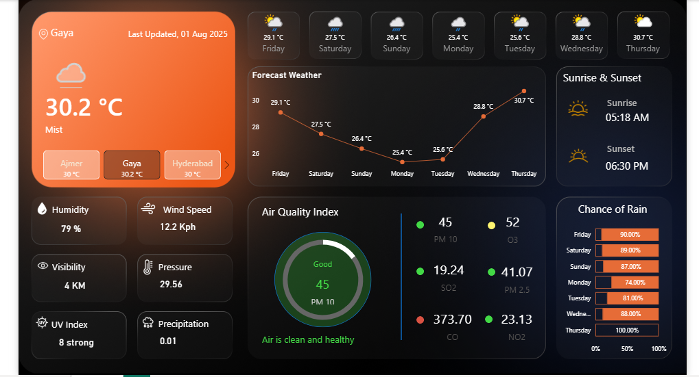

# 🔧 Project Title:
-  Live Weather Forecast Dashboard using Power BI

 # 🎯 Objective:
To create a Power BI dashboard that fetches and visualizes real-time or periodic weather forecast data (temperature, humidity, wind, etc.) for multiple cities or regions.

# 🧩 Tools Required:
- Power BI Desktop
- Power BI Service (for scheduling refreshes)
- API Source: OpenWeatherMap, WeatherAPI, or any REST AP
- Optional: Power Automate or Azure Functions for auto-refreshing.

# 🔁 Steps Involved:
1. Get Weather API Key
- Sign up at https://openweathermap.org
- Get a free API key

2. Pull Data using Power BI
- Use Power Query (Get Data → Web) to call the AP
- Example API call:
   http://api.openweathermap.org/data/2.5/weather?q=Delhi&appid=YOUR_API_KEY&units=metric

3. Transform Data in Power Query
- Extract relevant fields:
- City Name
- Temperature
- Humidity
- Weather Description
- Wind Speed
- Date/Time

4. Create Visuals
- Card visuals for temperature, humidity, wind
- Bar chart or line chart for 7 days forecast.
- Map visual for multiple cities
- Slicers for city or date filter.

5. Refresh Setup
- Manual refresh in Power BI Desktop
- Scheduled refresh via Power BI Service (requires Pro License)
- For truly real-time updates, use Power Automate + Flow or Azure Logic Apps

# 📊 Dashboard Example Sections:
- 🌡️ Current Temperature & Conditions
- 🗺️ Map of Multiple Cities
- 📈 Hourly or 7-days Forecast. (
- 💨 Wind Speed, pressure, UV index.
- 📅 Date/Time of Last Update

  
# 📘 Project Description for Resume/Portfolio:
Live Weather Forecast Dashboard (Power BI)
Developed an interactive weather monitoring dashboard using Power BI and OpenWeatherMap API. Integrated real-time data for multiple cities, visualized metrics such as temperature, humidity, and wind speed using map and time-series charts. Enabled scheduled refresh and dynamic filtering with slicers.  

